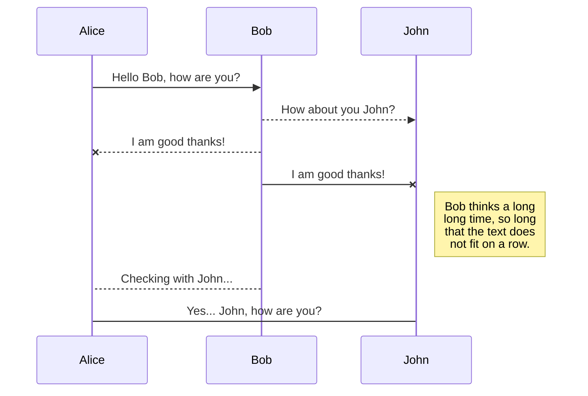
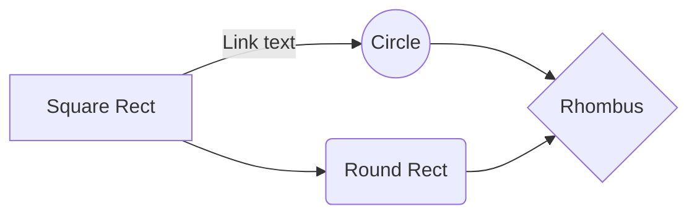

# pr-recommendator

Tries to fetch News from different publicly available APIs and analyse them to extract insights and suggest Public Relations related actions.

To-do list:

- add logging module
- try building up the database with more public available APIs
- add preprocessing module

# News Tracker

This GitHub repository is an attempt to build a news tracker for ABC Relations Inc. This markdown file will serve as the final report for the mini-project, and will **detail the design of the application and workflow**, together with **the explanation for the models employed** to achieve the objectives.

## Scenario

ABC Relations Inc. is a traditional Public Relation firm helping clients to protect, enhance or build their reputations through all kinds of media channels. ABC’s clients include public/private companies or public figures. Facing the big wave of digital transformation, ABC hired you as the lead engineer of digital innovation department. They would like you to help them build up a sophisticated application to solve the following problem:

## Problem

ABC Relations Inc. wants to actively track their clients’ news and react timely. However, most PR managers do not have enough time to read all news contents everyday, and because most of them are not from computing background, they would not understand too much technical details. What they want is a user-friendly tool to **notify them, tell them briefly what happened, provide background knowledge of the full story, identify key persons/companies who are relative/responsible, and ideally, PR reaction suggestions**. Meanwhile, this application should also be careful about **fake news**, **duplicate contents**, **out-of-date articles**, etc. In other words, whatever results this application provide, should always be accurate.

## PR Strategies

- Business events
- Community relations
- Corporate and social responsibility
- Crisis management
- Employee relations
- Media relations
- Social media

## Project Focus

The primary objective of this project is to build a toolset that can aid PR managers to:

1. Inspect the latest news
2. Understand news article in short period of time
3. Identify the key identities mentioned in each piece of news article

It is also of high interest for the application to be capable of suggesting PR reactions. Currently, the project focuses on a specific strategy: crisis management. There are two example situations that the application attempts to identify:

1. When a competitor launched a new product or the public sentiment has surged in a short period of time
2. When a target company has received increasing negative communication and perception

## Methodologies

To fulfil the project focuses:

1. News would be fetched from publicly available APIs
   - NewsAPI, The New York Times API
2. Text summarisation
   - Extractive summary: turn an article into a handful number of key sentences
3. Key entities detecion
   - Name Entity Recognition (NER): list the name entities in the article
   - Extract the top-ranked entities from text documents
4. Sentiment scoring
   - Gives a sentiment score on each article and use the scores to detect if there is a upsurge or downfall in sentiment

## KaTeX

You can render LaTeX mathematical expressions using [KaTeX](https://khan.github.io/KaTeX/):

The _Gamma function_ satisfying $\Gamma(n) = (n-1)!\quad\forall n\in\mathbb N$ is via the Euler integral

$$
\Gamma(z) = \int_0^\infty t^{z-1}e^{-t}dt\,.
$$

> You can find more information about **LaTeX** mathematical expressions [here](http://meta.math.stackexchange.com/questions/5020/mathjax-basic-tutorial-and-quick-reference).

## UML diagrams

You can render UML diagrams using [Mermaid](https://mermaidjs.github.io/). For example, this will produce a sequence diagram:

And this will produce a flow chart:

